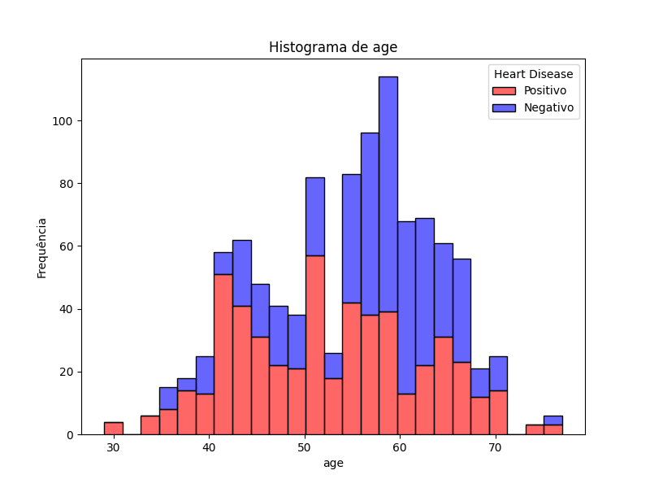
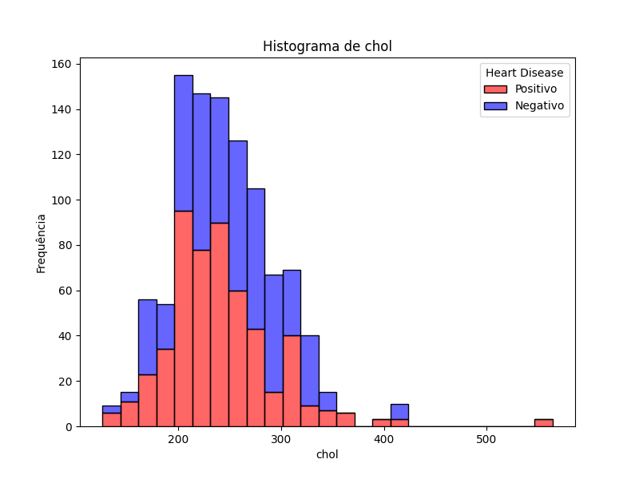
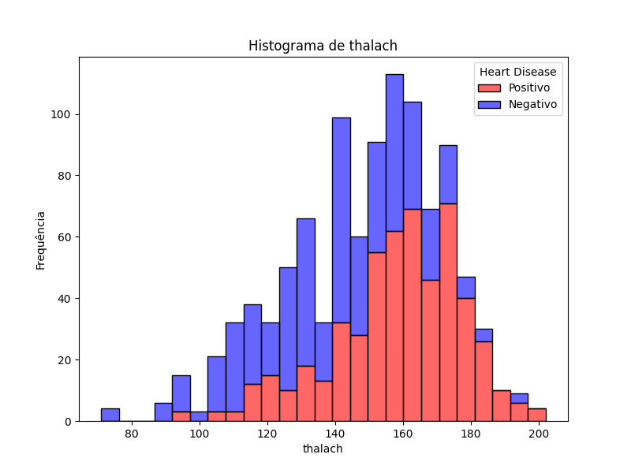
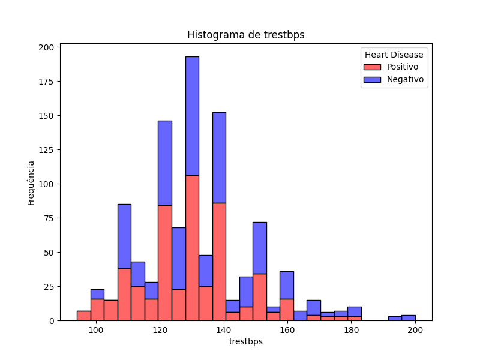
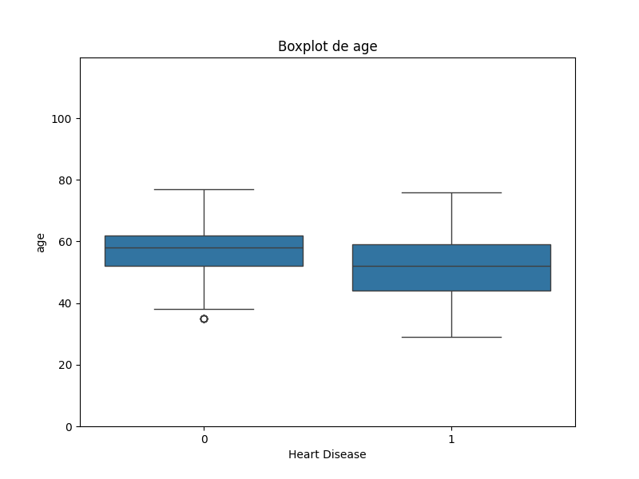
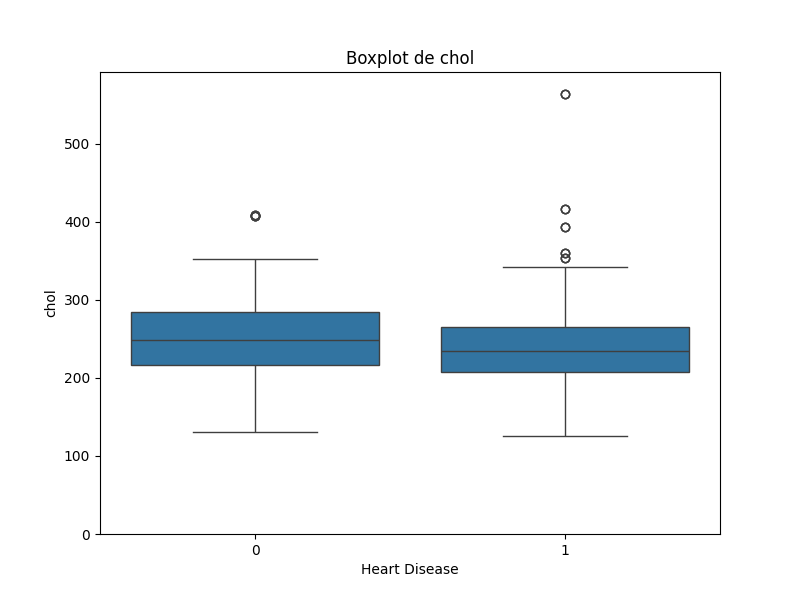
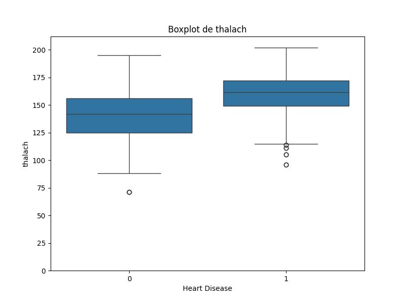
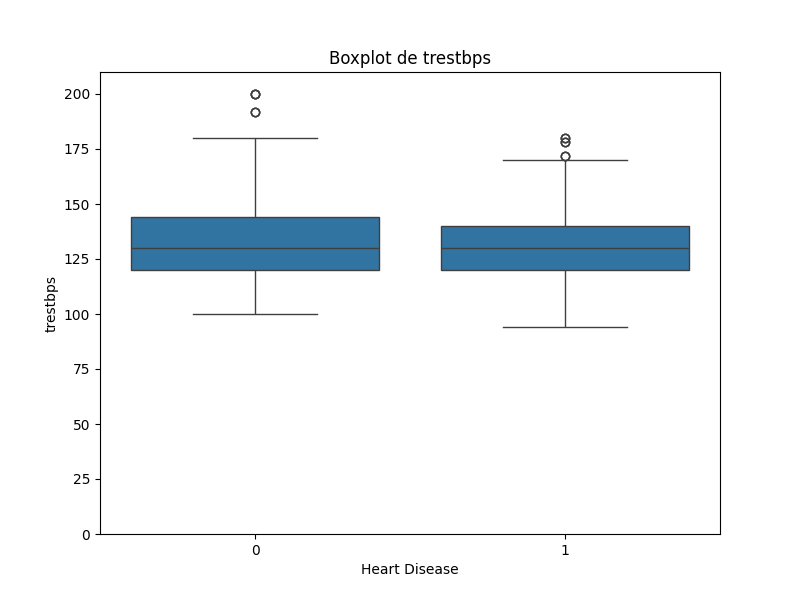
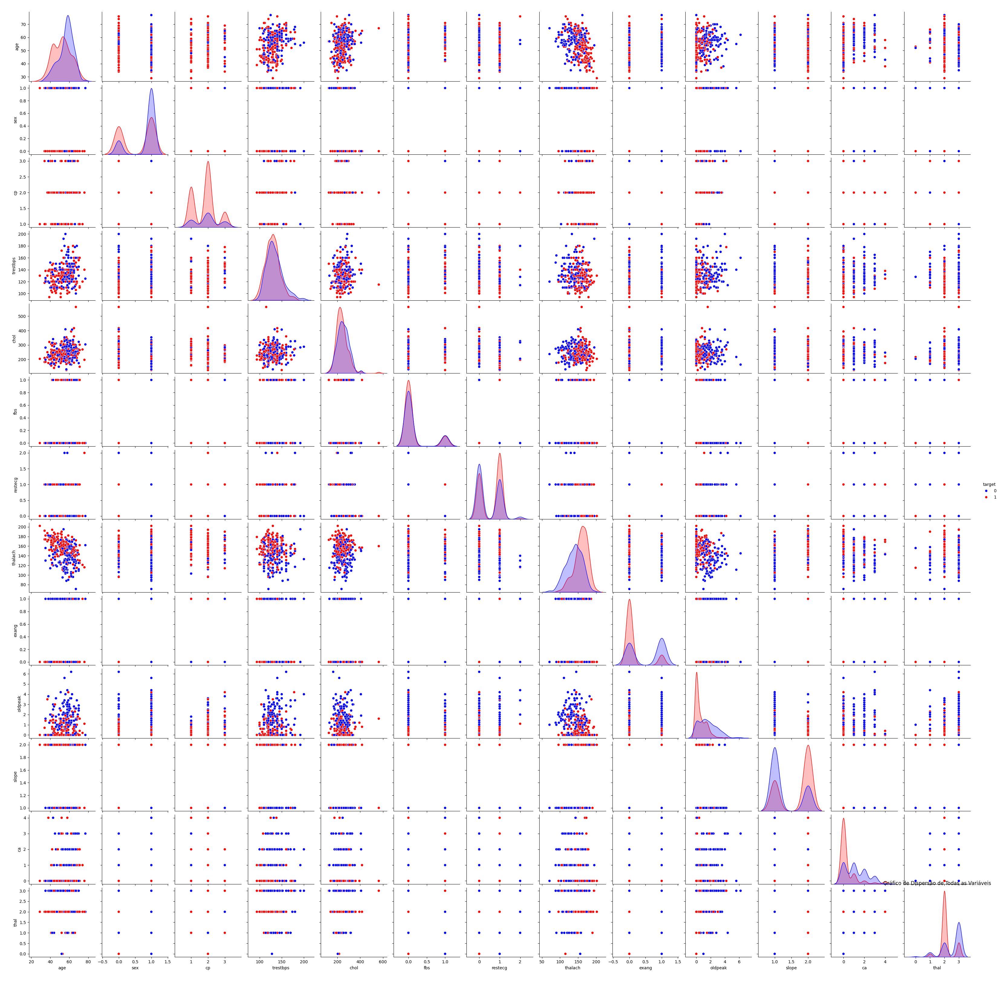

# Atividade 1 - Regressão Logística

## Descrição do Data Set
`age`: Idade do paciente.
*  Idade pode influenciar o risco de doenças cardíacas.

`sex`: Sexo (1 = masculino; 0 = feminino).
* Homens e mulheres podem ter diferentes riscos cardíacos.

`cp`: Tipo de dor no peito (4 valores: 1 = angina típica; 2 = angina atípica; 3 = dor não anginosa; 4 = assintomática).
* Angina é uma dor no peito ou sensação de pressão que ocorre quando o músculo cardíaco não recebe oxigênio suficiente.

`trestbps`: Pressão arterial em repouso (mm Hg).
* Pressão alta pode ser um fator de risco para doenças cardíacas.

`chol`: Colesterol sérico em mg/dl.
* Níveis altos de colesterol podem levar a aterosclerose.

`fbs`: Açúcar no sangue em jejum > 120 mg/dl (1 = verdadeiro; 0 = falso).
* Açúcar elevado pode indicar diabetes, um fator de risco cardíaco.

`restecg`: Resultados do eletrocardiograma em repouso (0 = normal; 1 = com anormalidade na onda ST-T; 2 = hipertrofia ventricular esquerda).
* Anormalidades no ECG podem indicar problemas cardíacos.

`thalach`: Frequência cardíaca máxima atingida.
* Frequência cardíaca alta pode indicar boa saúde cardiovascular.

`exang`: Angina induzida por exercício (1 = sim; 0 = não).
* Angina durante exercício pode indicar doença arterial coronariana.

`oldpeak`: Depressão do segmento ST induzida por exercício em relação ao repouso.
* Depressão ST pode indicar isquemia miocárdica.

`slope`: Inclinação do segmento ST no pico do exercício (1 = subida; 2 = plana; 3 = descendente).
* Inclinação ST pode ajudar a diagnosticar a gravidade da isquemia.

`ca`: Número de vasos principais (0-3) coloridos por fluoroscopia.
* Mais vasos coloridos podem indicar maior gravidade da doença.

`thal`: 0 = normal; 1 = defeito fixo; 2 = defeito reversível.
* Defeitos no tálio podem indicar áreas de isquemia ou infarto.

`target`: Diagnóstico de doença cardíaca (1 = presença de doença; 0 = ausência de doença).
* Indica se o paciente tem ou não doença cardíaca.

## Análise Descritiva das Variáveis

|       |        age |         sex |         cp |   trestbps |      chol |         fbs |     restecg |   thalach |       exang |    oldpeak |      slope |          ca |       thal |      target |
|:------|-----------:|------------:|-----------:|-----------:|----------:|------------:|------------:|----------:|------------:|-----------:|-----------:|------------:|-----------:|------------:|
| count | 1025       | 1025        | 528        |  1025      | 1025      | 1025        | 1025        | 1025      | 1025        | 1025       | 951        | 1025        | 1025       | 1025        |
| mean  |   54.4341  |    0.69561  |   1.82955  |   131.612  |  246      |    0.149268 |    0.529756 |  149.114  |    0.336585 |    1.07151 |   1.49317  |    0.754146 |    2.3239  |    0.513171 |
| std   |    9.07229 |    0.460373 |   0.658702 |    17.5167 |   51.5925 |    0.356527 |    0.527878 |   23.0057 |    0.472772 |    1.17505 |   0.500216 |    1.0308   |    0.62066 |    0.50007  |
| min   |   29       |    0        |   1        |    94      |  126      |    0        |    0        |   71      |    0        |    0       |   1        |    0        |    0       |    0        |
| 25%   |   48       |    0        |   1        |   120      |  211      |    0        |    0        |  132      |    0        |    0       |   1        |    0        |    2       |    0        |
| 50%   |   56       |    1        |   2        |   130      |  240      |    0        |    1        |  152      |    0        |    0.8     |   1        |    0        |    2       |    1        |
| 75%   |   61       |    1        |   2        |   140      |  275      |    0        |    1        |  166      |    1        |    1.8     |   2        |    1        |    3       |    1        |
| max   |   77       |    1        |   3        |   200      |  564      |    1        |    2        |  202      |    1        |    6.2     |   2        |    4        |    3       |    1        |

> As colunas `age`, `cp` e `slope` tiveram seus valores 0 trocados por NaN pois indicam ausência de dado


---

## Referência de Imagens

### Histogramas:
|  |  |
|--------------------------------|--------------------------------|
|  |  |

### Foi observado:

* Maior porcentagem de pacientes com doenças cardíacas tem entre 40 - 54 anos
* Maior porcentagem de pacientes com doenças cardíacas tem 180 - 260 de colesterol
* Pacientes com frequência cardíaca máxima maior que 150 apresentam alguma doença cardíaca
* A pressão arterial em repouso é bem distribuída entre pacientes com e sem doença cardíaca

### Boxplots:
|  |  |
|--------------------------------|--------------------------------|
|  |  |

### Foi observado:

* Apenas a frequência cardíaca máxima (thalach) parece ser um maior indicador do grupo com doenças cardíacas, os outros estão bem distribuídos


### Pairplot (Gráfico de Dispersão):


### Foi observado:

* Obs 1
* Obs 2


---

## Teste de Correlação (Pearson)
> 1 = correlação perfeita
>
> -1 = correlação negativa perfeita
>
> 0 = sem correlação

### `age` vs `trestbps`:

| Coeficiente de Correlação | P-Valor |
| ------------------------- | ------- |
| 0.2711 | 0.0000 |

Fazer para outras correlações...

---

## Modelo Explicativo: Regressão Logística

```python
# Preparar os dados para o modelo (Com Age e Trestbps: Intercept = 3.96587 / 98.15% de probabilidade)
X = data[['age', 'trestbps', 'thalach', 'cp', 'ca']].dropna()
y = data.loc[X.index, 'target']

# Ajustar o modelo de regressão logística
model = LogisticRegression()
model.fit(X, y)

# Resumo dos coeficientes: Valores negativos do intercepto levam a probabilidades baixas e valores positivos a probabilidades altas
coef = pd.DataFrame(model.coef_, columns=X.columns)
coef['Intercept'] = model.intercept_
print(f'\n\n{coef}')
```

> Explicar a ideia do modelo e como funciona a regressão logistica por alto


---

## Interpretação dos Resultados

Coeficientes do modelo e a influência que as variáveis causam nele

O AIC do modelo e sua relevância


---

## Conclusão

Os fatores de risco mais relevantes para a previsão da doença cardíaca são `tais` e esses insights podem ser utilizados em prática clínica ou em futuros estudos de `tal maneira`