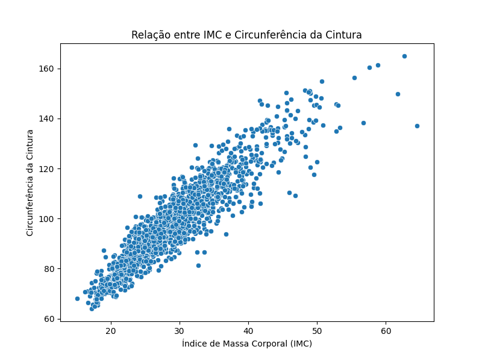

# Atividade 1 - Regressão Logística

## Descrição dos Dados
`RIDAGEYR`: Idade do paciente.

`BMXBMI`: IMC do paciente

`BPXSY1`: Pressão Arterial Sistólica (PAS)

`LBXGLU`: Glicose no sangue

`BMXWAIST`: Circunferência da Cintura

---


## Análise Descritiva das Variáveis

|       |   RIDAGEYR |     BMXBMI |    BPXSY1 |   LBXGLU |   BMXWAIST |
|:------|-----------:|-----------:|----------:|---------:|-----------:|
| count |  1504      | 1504       | 1504      | 1504     |  1504      |
| mean  |    40.6842 |   29.5005  |  121.318  |  109.093 |    99.1941 |
| std   |    11.8597 |    7.13557 |   16.4877 |   38.371 |    17.0554 |
| min   |    20      |   15.1     |   84      |   21     |    64      |
| 25%   |    31      |   24.3     |  110      |   94     |    87.075  |
| 50%   |    41      |   28.5     |  118      |  100     |    97.1    |
| 75%   |    51      |   33.5     |  130      |  109     |   109.2    |
| max   |    60      |   64.5     |  236      |  454     |   165      |

---


## Scatter plots

|  |  |
| --- | --- |

### Foi observado:

* IMC não parece ter correlação com a Glicose no sangue, visto que os pontos estão distribuídos
* IMC parece ter uma forte correlação com a Circunferência da Cintura (como esperado)

---


## Modelo de Regressão Linear

> MSE: Indica o quão grande, em média, são os erros das previsões do modelo. Valores menores são melhores
>
> Coeficiente da Regressão: Representa a relação entre X e y. Um valor positivo indica que à medida que X aumenta, y também tende a aumentar
>
> R²: Mede a eficácia geral do modelo. Valores próximos de 1 indicam um modelo que explica bem a variabilidade dos dados, enquanto valores próximos de 0 indicam o contrário

### BMXBMI x LBXGLU
| Métrica                        | Valor   |
|-------------------------------|---------|
| Erro quadrático médio (MSE)   | 1427.91  |
| Coeficiente da regressão      | 0.92 |
| Coeficiente de determinação (R²) | 0.03  |
    
### BMXBMI x BMXWAIST
| Métrica                        | Valor   |
|-------------------------------|---------|
| Erro quadrático médio (MSE)   | 43.10  |
| Coeficiente da regressão      | 2.21 |
| Coeficiente de determinação (R²) | 0.85  |

### Foi observado:

* BMXBMI x LBXGLU apesar do coeficiente da regressão de 0.93, o alto MSE e baixo R² sugere que o modelo está performando mal
* BMXBMI x BMXWAIST tem baixo MSE e alto R² o que indica que o modelo está performando bem

---

## Estimando BMXWAIST para um BMXBMI específico

```python
# Definir as variáveis dependente (X) e independente (y)
X = df[['BMXBMI']]
y = df['BMXWAIST']

# Criar e treinar o modelo de regressão linear
model = LinearRegression()
model.fit(X, y)

# Verificar qual a estimativa de BMXWAIST para um IMC específico
imc = 25
waist_pred = model.predict([[imc]])[0]
print(f"Para um IMC de {imc}, a circunferência da cintura estimada é {waist_pred:.2f} cm.")
```

> Para um IMC de 25, a circunferência da cintura estimada é 89.27 cm.