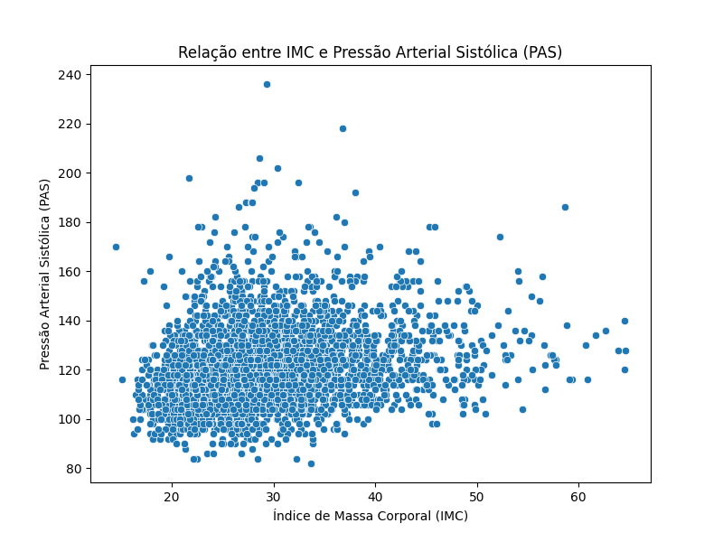

# Atividade 1 - Regressão Logística

## Descrição dos Dados
`RIDAGEYR`: Idade do paciente.

`BMXBMI`: IMC do paciente

`BPXSY1`: Pressão Arterial Sistólica (PAS)


## Análise Descritiva das Variáveis

|       |   RIDAGEYR |     BMXBMI |    BPXSY1 |
|:------|-----------:|-----------:|----------:|
| count |  3536      | 3536       | 3536      |
| mean  |    39.9751 |   29.5806  |  121.085  |
| std   |    11.789  |    7.31104 |   15.8881 |
| min   |    20      |   14.5     |   82      |
| 25%   |    30      |   24.3     |  110      |
| 50%   |    40      |   28.4     |  118      |
| 75%   |    50      |   33.5     |  130      |
| max   |    60      |   64.6     |  236      |

> A coluna `RIDAGEYR` foi filtrada pelas idades >= 20 e <=60, as colunas `BMXBMI` e `BPXSY1` tiveram suas linhas com NaN dropadas


---

## Scatter plot (Gráfico de Dispersão):


> Correlação Positiva: Se os pontos parecem formar uma linha inclinada para cima (da esquerda para a direita), indica que as duas variáveis tendem a aumentar juntas
>
> Correlação Negativa: Se a linha se inclina para baixo, isso significa que uma variável tende a diminuir à medida que a outra aumenta
>
> Nenhuma Correlação: Se os pontos estão espalhados aleatoriamente, sem um padrão claro, há pouca ou nenhuma correlação entre as variáveis

### Foi observado:

* IMC não parece ter correlação com a PAS, visto que os pontos estão distribuídos.


---

## Modelo Explicativo: Regressão Linear

```python
# Remover dados faltantes
df = df.dropna(subset=['BMXBMI', 'BPXSY1'])

# Definir as variáveis dependente (X) e independente (y)
X = df[['BMXBMI']]
y = df['BPXSY1']

# Criar e treinar o modelo de regressão linear
model = LinearRegression()
model.fit(X, y)

# Fazer predições
y_pred = model.predict(X)

# Avaliar o modelo
mse = mean_squared_error(y, y_pred)
r2 = r2_score(y, y_pred)
coef = model.coef_[0]
```

O que é Regressão Linear?

* Regressão Linear é um método estatístico que modela a relação entre duas variáveis, assumindo que essa relação é uma linha reta. 
    
    * Exemplo Simples: Se você quer prever a altura de uma planta com base no número de dias desde que ela foi plantada, a regressão linear pode ajudar a encontrar essa relação direta entre tempo e crescimento.

Como Funciona?

* A regressão linear encontra a melhor linha reta que passa pelos dados, minimizando a distância entre os pontos reais e a linha prevista.

    * Exemplo Simples: Imagine que você tenha dados sobre o tempo que as pessoas estudaram e suas notas em um teste. A regressão linear pode criar uma equação que mostra como o aumento nas horas de estudo afeta as notas, permitindo prever a nota com base nas horas estudadas.


---

## Avaliação do Modelo e Interpretação dos Coeficientes

| Métrica                        | Valor   |
|-------------------------------|---------|
| Erro quadrático médio (MSE)   | 239.35  |
| Coeficiente da regressão      | 0.49 |
| Coeficiente de determinação (R²) | 0.05  |

> Erro Quadrático Médio (MSE - Mean Squared Error):
>
> É uma forma de quantificar quão distantes estão as previsões do modelo em relação aos valores reais. Um MSE menor indica previsões mais precisas
>
> Coeficiente da Regressão (coef):
>
> Um coeficiente de 0.49 significa que, para cada aumento de 1 unidade em X, espera-se um aumento de 0.49 unidades em y
>
> Se estamos analisando como as horas de estudo (X) afetam a nota em um exame (y), um coeficiente de 0.49 indica que, para cada hora adicional de estudo, a nota aumenta em média 0.49 pontos
>
> Coeficiente de Determinação (R² - R-squared):
>
> Um R² de 0.05 significa que apenas 5% da variação total em y é explicada pelo modelo. Isso sugere que o modelo não está capturando bem a relação entre X e y (Valores próximos de 1 indicam um modelo que explica bem a variabilidade dos dados, enquanto valores próximos de 0 indicam o contrário)
>
> Continuando com o exemplo das horas de estudo e nota no exame, um R² de 0.05 indica que apenas 5% das variações nas notas podem ser explicadas pelas horas de estudo, sugerindo que outros fatores estão influenciando mais as notas

## Conclusão

Temos um MSE Alto e R² Baixo, logo o modelo não está perfomando bem. As previsões estão, em média, bem distantes dos valores reais, e o modelo explica muito pouco da variabilidade nos dados.

## Perguntas

1. Podemos afirmar, com base no modelo, que existe uma relação estatisticamente significativa entre o Índice de Massa Corporal (IMC) e a Pressão Arterial Sistólica (PAS)? Explique.

    * Apesar do coeficiente de regressão sugerir uma tendência de aumento da PAS com o aumento do IMC, o alto MSE e baixo R² impedem que façamos essa afirmação.

2. Refaça o exercício para IMC e o nível de glicose no sangue (LBGLU), e IMC e a circunferência da cintura (BMXWAIST). Quais dessas medidas estão correlacionadas?

    * IMC e Circunferência da Cintura. Podemos entender o porque nesse [markdown](https://github.com/mfollypp/Machine-Learning-for-Healthcare/blob/master/Atividade%202/atividade2_bmi_glu_waist.md#foi-observado-1)

3. Utilizando o modelo de regressão, qual seria o valor estimado da circunferência da cintura para um indivíduo com IMC igual a 25?

    * 89.27 cm. Podemos entender o porque nesse [markdown](https://github.com/mfollypp/Machine-Learning-for-Healthcare/blob/master/Atividade%202/atividade2_bmi_glu_waist.md#estimando-bmxwaist-para-um-bmxbmi-espec%C3%ADfico)