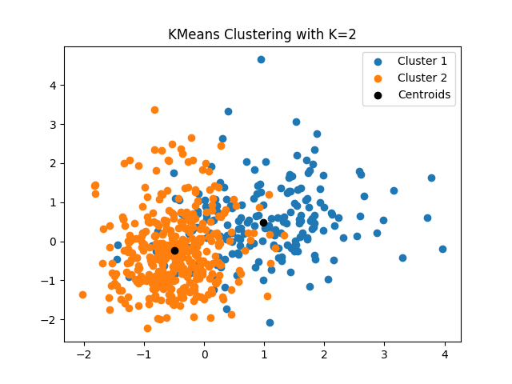
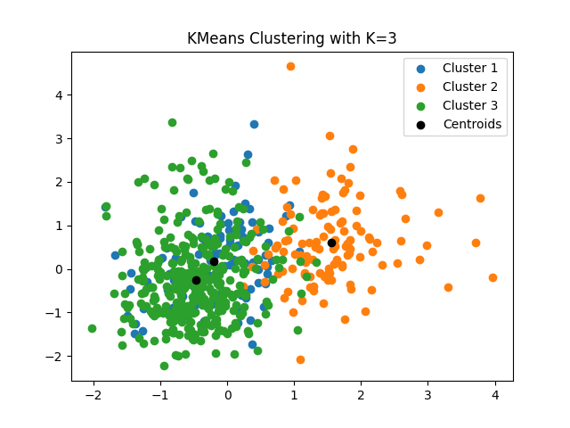
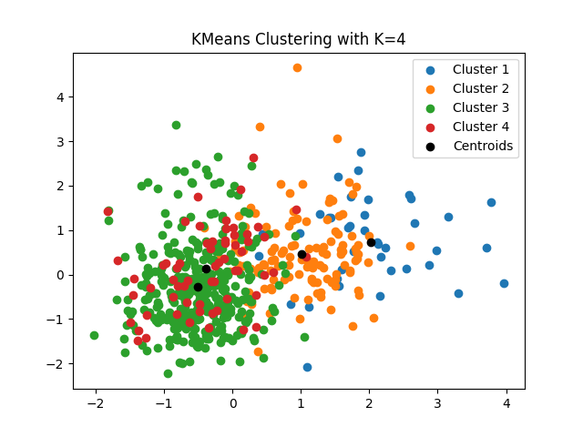
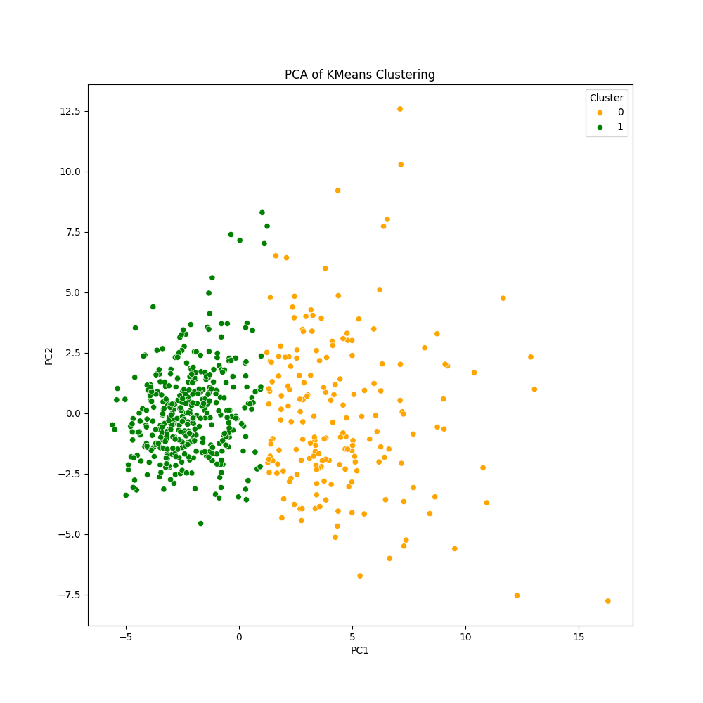

# Atividade 3

## Descrição do Dataset

- `Radius`: Média do raio (distância do centro aos pontos do perímetro) Texture: Desvio padrão dos valores de cinza da superfície celular
- `Perimeter`: Perímetro médio
- `Area`: Área média
- `Smoothness`: Variação local nos comprimentos dos raios
- `Compactness`: (Perímetro² / Área - 1.0)
- `Concavity`: Severidade das concavidades na superfície celular
- `Concave points`: Número de pontos côncavos no contorno
- `Symmetry`: Simetria da célula
- `Fractal dimension`: Dimensão fractal ("aproximação" da irregularidade)

---

## Analise descritiva das variáveis

|       |   mean radius |   mean texture |   mean perimeter |   mean area |   mean smoothness |   mean compactness |   mean concavity |   mean concave points |   mean symmetry |   mean fractal dimension |   radius error |   texture error |   perimeter error |   area error |   smoothness error |   compactness error |   concavity error |   concave points error |   symmetry error |   fractal dimension error |   worst radius |   worst texture |   worst perimeter |   worst area |   worst smoothness |   worst compactness |   worst concavity |   worst concave points |   worst symmetry |   worst fractal dimension |     target |
|:------|--------------:|---------------:|-----------------:|------------:|------------------:|-------------------:|-----------------:|----------------------:|----------------:|-------------------------:|---------------:|----------------:|------------------:|-------------:|-------------------:|--------------------:|------------------:|-----------------------:|-----------------:|--------------------------:|---------------:|----------------:|------------------:|-------------:|-------------------:|--------------------:|------------------:|-----------------------:|-----------------:|--------------------------:|-----------:|
| count |     569       |      569       |          569     |     569     |       569         |        569         |      569         |           569         |     569         |             569          |     569        |      569        |         569       |     569      |       569          |         569         |       569         |           569          |     569          |              569          |      569       |       569       |          569      |      569     |        569         |          569        |        569        |            569         |      569         |               569         | 569        |
| mean  |      14.1273  |       19.2896  |           91.969 |     654.889 |         0.0963603 |          0.104341  |        0.0887993 |             0.0489191 |       0.181162  |               0.0627976  |       0.405172 |        1.21685  |           2.86606 |      40.3371 |         0.00704098 |           0.0254781 |         0.0318937 |             0.0117961  |       0.0205423  |                0.0037949  |       16.2692  |        25.6772  |          107.261  |      880.583 |          0.132369  |            0.254265 |          0.272188 |              0.114606  |        0.290076  |                 0.0839458 |   0.627417 |
| std   |       3.52405 |        4.30104 |           24.299 |     351.914 |         0.0140641 |          0.0528128 |        0.0797198 |             0.0388028 |       0.0274143 |               0.00706036 |       0.277313 |        0.551648 |           2.02185 |      45.491  |         0.00300252 |           0.0179082 |         0.0301861 |             0.00617029 |       0.00826637 |                0.00264607 |        4.83324 |         6.14626 |           33.6025 |      569.357 |          0.0228324 |            0.157336 |          0.208624 |              0.0657323 |        0.0618675 |                 0.0180613 |   0.483918 |
| min   |       6.981   |        9.71    |           43.79  |     143.5   |         0.05263   |          0.01938   |        0         |             0         |       0.106     |               0.04996    |       0.1115   |        0.3602   |           0.757   |       6.802  |         0.001713   |           0.002252  |         0         |             0          |       0.007882   |                0.0008948  |        7.93    |        12.02    |           50.41   |      185.2   |          0.07117   |            0.02729  |          0        |              0         |        0.1565    |                 0.05504   |   0        |
| 25%   |      11.7     |       16.17    |           75.17  |     420.3   |         0.08637   |          0.06492   |        0.02956   |             0.02031   |       0.1619    |               0.0577     |       0.2324   |        0.8339   |           1.606   |      17.85   |         0.005169   |           0.01308   |         0.01509   |             0.007638   |       0.01516    |                0.002248   |       13.01    |        21.08    |           84.11   |      515.3   |          0.1166    |            0.1472   |          0.1145   |              0.06493   |        0.2504    |                 0.07146   |   0        |
| 50%   |      13.37    |       18.84    |           86.24  |     551.1   |         0.09587   |          0.09263   |        0.06154   |             0.0335    |       0.1792    |               0.06154    |       0.3242   |        1.108    |           2.287   |      24.53   |         0.00638    |           0.02045   |         0.02589   |             0.01093    |       0.01873    |                0.003187   |       14.97    |        25.41    |           97.66   |      686.5   |          0.1313    |            0.2119   |          0.2267   |              0.09993   |        0.2822    |                 0.08004   |   1        |
| 75%   |      15.78    |       21.8     |          104.1   |     782.7   |         0.1053    |          0.1304    |        0.1307    |             0.074     |       0.1957    |               0.06612    |       0.4789   |        1.474    |           3.357   |      45.19   |         0.008146   |           0.03245   |         0.04205   |             0.01471    |       0.02348    |                0.004558   |       18.79    |        29.72    |          125.4    |     1084     |          0.146     |            0.3391   |          0.3829   |              0.1614    |        0.3179    |                 0.09208   |   1        |
| max   |      28.11    |       39.28    |          188.5   |    2501     |         0.1634    |          0.3454    |        0.4268    |             0.2012    |       0.304     |               0.09744    |       2.873    |        4.885    |          21.98    |     542.2    |         0.03113    |           0.1354    |         0.396     |             0.05279    |       0.07895    |                0.02984    |       36.04    |        49.54    |          251.2    |     4254     |          0.2226    |            1.058    |          1.252    |              0.291     |        0.6638    |                 0.2075    |   1        |

---

## Análise descritiva dos dados normalizados

|       |   mean radius |   mean texture |   mean perimeter |     mean area |   mean smoothness |   mean compactness |   mean concavity |   mean concave points |   mean symmetry |   mean fractal dimension |   radius error |   texture error |   perimeter error |    area error |   smoothness error |   compactness error |   concavity error |   concave points error |   symmetry error |   fractal dimension error |   worst radius |   worst texture |   worst perimeter |   worst area |   worst smoothness |   worst compactness |   worst concavity |   worst concave points |   worst symmetry |   worst fractal dimension |        target |
|:------|--------------:|---------------:|-----------------:|--------------:|------------------:|-------------------:|-----------------:|----------------------:|----------------:|-------------------------:|---------------:|----------------:|------------------:|--------------:|-------------------:|--------------------:|------------------:|-----------------------:|-----------------:|--------------------------:|---------------:|----------------:|------------------:|-------------:|-------------------:|--------------------:|------------------:|-----------------------:|-----------------:|--------------------------:|--------------:|
| count | 569           |  569           |    569           | 569           |     569           |      569           |    569           |         569           |   569           |            569           |  569           |   569           |     569           | 569           |      569           |       569           |     569           |             569        |     569          |             569           |   569          |   569           |     569           |   569        |      569           |       569           |     569           |          569           |    569           |             569           | 569           |
| mean  |  -1.37363e-16 |    6.86816e-17 |     -1.24876e-16 |  -2.18532e-16 |      -8.36667e-16 |        1.87314e-16 |      4.99503e-17 |          -4.99503e-17 |     1.74826e-16 |              4.74528e-16 |    2.37264e-16 |    -1.12388e-16 |      -1.12388e-16 |  -1.31119e-16 |       -1.52973e-16 |         1.74826e-16 |       1.62338e-16 |               0        |       8.7413e-17 |              -6.24379e-18 |    -8.2418e-16 |     1.24876e-17 |      -3.74627e-16 |     0        |       -2.37264e-16 |        -3.37164e-16 |       7.49254e-17 |            2.24776e-16 |      2.62239e-16 |              -5.74428e-16 |  -4.99503e-17 |
| std   |   1.00088     |    1.00088     |      1.00088     |   1.00088     |       1.00088     |        1.00088     |      1.00088     |           1.00088     |     1.00088     |              1.00088     |    1.00088     |     1.00088     |       1.00088     |   1.00088     |        1.00088     |         1.00088     |       1.00088     |               1.00088  |       1.00088    |               1.00088     |     1.00088    |     1.00088     |       1.00088     |     1.00088  |        1.00088     |         1.00088     |       1.00088     |            1.00088     |      1.00088     |               1.00088     |   1.00088     |
| min   |  -2.02965     |   -2.22925     |     -1.9845      |  -1.45444     |      -3.11208     |       -1.61014     |     -1.11487     |          -1.26182     |    -2.74412     |             -1.81986     |   -1.05992     |    -1.55426     |      -1.04405     |  -0.737829    |       -1.77606     |        -1.2981      |      -1.0575      |              -1.91345  |      -1.53289    |              -1.09697     |    -1.7269     |    -2.22399     |      -1.69336     |    -1.22242  |       -2.68269     |        -1.44388     |      -1.30583     |           -1.74506     |     -2.16096     |              -1.60184     |  -1.29768     |
| 25%   |  -0.689385    |   -0.725963    |     -0.691956    |  -0.667195    |      -0.710963    |       -0.747086    |     -0.743748    |          -0.737944    |    -0.70324     |             -0.722639    |   -0.623571    |    -0.694809    |      -0.623768    |  -0.494754    |       -0.624018    |        -0.692926    |      -0.557161    |              -0.67449  |      -0.651681   |              -0.585118    |    -0.674921   |    -0.748629    |      -0.689578    |    -0.642136 |       -0.69123     |        -0.681083    |      -0.756514    |           -0.7564      |     -0.641864    |              -0.691912    |  -1.29768     |
| 50%   |  -0.215082    |   -0.104636    |     -0.23598     |  -0.295187    |      -0.0348911   |       -0.22194     |     -0.34224     |          -0.397721    |    -0.0716265   |             -0.178279    |   -0.292245    |    -0.197498    |      -0.286652    |  -0.347783    |       -0.220335    |        -0.28102     |      -0.199065    |              -0.140496 |      -0.21943    |              -0.22994     |    -0.26904    |    -0.0435156   |      -0.28598     |    -0.341181 |       -0.0468428   |        -0.269501    |      -0.218232    |           -0.223469    |     -0.127409    |              -0.216444    |   0.770609    |
| 75%   |   0.469393    |    0.584176    |      0.499677    |   0.363507    |       0.636199    |        0.493857    |      0.526062    |           0.646935    |     0.530779    |              0.470983    |    0.2661      |     0.466552    |       0.243031    |   0.106773    |        0.368355    |         0.389654    |       0.336752    |               0.472657 |       0.355692   |               0.288642    |     0.522016   |     0.658341    |       0.540279    |     0.357589 |        0.597545    |         0.539669    |       0.531141    |            0.71251     |      0.450138    |               0.450762    |   0.770609    |
| max   |   3.97129     |    4.65189     |      3.97613     |   5.25053     |       4.77091     |        4.56842     |      4.24359     |           3.92793     |     4.48475     |              4.91092     |    8.90691     |     6.65528     |       9.46199     |  11.0418      |        8.03        |         6.14348     |      12.0727      |               6.6496   |       7.07192    |               9.85159     |     4.09419    |     3.88591     |       4.28734     |     5.93017  |        3.95537     |         5.11288     |       4.70067     |            2.68588     |      6.04604     |               6.84686     |   0.770609    |

---

## Aplicação do K-Means e Análise dos Clusters

### 2 Clusters

> No caso é o que a gente espera, pois o intuito é agrupar em tumores benignos e malignos

### 3 Clusters

> Há sobreposição dos clusters 1 e 3 e não faz sentido para o que buscamos

### 4 Clusters

> Há sobreposição dos clusters 1 com 2 e 3 com 4, além de não fazer sentido para o que buscamos

## Visualição dos Resultados e Cluster com PCA

> Aqui já podemos observar uma melhor disposição de clusters diferentes

Discutir como os agrupamentos podem ajudar na estratificação dos pacientes e no entendimento dos fatores celulares que influenciam o risco de malignidade:

> Os agrupamentos podem ajudar na estratificação dos pacientes pois pode identificar a partir de um conjunto de sintomas e dados se o paciente em questão se encontra em um grupo de risco ou não, fazendo com que pacientes categorizados como grupo de risco recebam um tratamento mais imediato, ou até mais específico dependendo do tipo de categorização do cluster.
>
> Nos fatores celulares que influenciam o risco de malignidade é a mesma lógica, dado um conjunto de dados é possível categorizar 2 grupos, 1 maligno e 1 benigno, o que pode ajudar os médicos a direcionar os pacientes para exames mais específicos por exemplo.