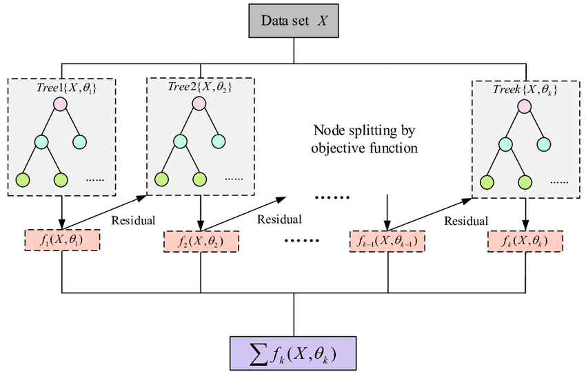

# Projeto de Aplicação - Of Genomes And Genetics

## 1. Motivação e Objetivo

O rápido crescimento populacional, aliado à falta de acesso a cuidados básicos, tem aumentado a incidência de doenças genéticas. 

Este estudo busca destacar a importância dos testes genéticos durante a gravidez como estratégia para reduzir a mortalidade infantil causada por doenças hereditárias, pegando o caso particular da Leigh Syndrome. 

Nele vamos usar o XGBoost para classificar uma possível doença genética com base em dados de saúde e histórico familiar do paciente.

---

## 2. Descrição do Dataset

### Descrição dos dados

### Etapas de preparação dos dados ou pré-processamento

Remover as colunas:

- Patient Id
- Patient First Name
- Family Name
- Father's name
- Institute Name
- Location of Institute
- Test 1
- Test 2
- Test 3
- Test 4
- Test 5
- Parental consent
- Place of birth
- Symptom 1
- Symptom 2
- Symptom 3
- Symptom 4
- Symptom 5
- Patient Age
- Status
- Birth asphyxia
- Autopsy shows birth defect (if applicable)
- Follow-up

Filtrar os valores NaN e similares a NaN, e converter os mesmos para NaN

Remover as linhas com NaN

Transformar dados categóricos com One-Hot Encoding usando o get_dummies()

Converter os valores para float64

### Link para a versão disponibilizada do dataset
https://www.kaggle.com/datasets/aryarishabh/of-genomes-and-genetics-hackerearth-ml-challenge

---

## 3. Modelo de Machine Learning

Conceitos importantes para entender o XGBoost (links em ordem para os vídeos do [StatQuest with Josh Starmer](https://www.youtube.com/@statquest)):

### [Cross Validation](https://www.youtube.com/watch?v=fSytzGwwBVw)

O Cross Validation é uma técnica usada para avaliar e comparar diferentes modelos de machine learning. 

Em vez de dividir o dataset em partes fixas para treino e validação, ele funciona dividindo o dataset em vários blocos (ou "folds"). 

Cada bloco é usado, uma vez, como conjunto de validação enquanto os outros servem para treino. 

Assim, o modelo é treinado e avaliado várias vezes, garantindo que todas as partes do dataset sejam usadas tanto para treino quanto para validação. 

No final, os resultados são resumidos, dando uma visão mais confiável sobre o desempenho do modelo no dataset.

---

### [Confusion Matrices](https://www.youtube.com/watch?v=Kdsp6soqA7o)
A Confusion Matrix é uma ferramenta que ajuda a avaliar a performance de um modelo de classificação. 

Ela organiza os resultados em uma tabela NxN, onde **N é o número de classes (ou categorias)** no problema.

**Linhas**: mostram o que o modelo previu.

**Colunas**: mostram o valor real (a verdade).

A diagonal principal da matriz representa as **previsões corretas** (acertos). 

O restante da matriz mostra os **erros**, indicando como o modelo se confunde ao classificar os dados.

Por exemplo, em um modelo que prevê se uma pessoa tem ou não uma doença, a matriz poderia ser algo assim:

|                 | **Tem doença (Real)** | **Não tem doença (Real)** |
|-----------------|------------------------|---------------------------|
| **Tem doença (Previsto)** | Verdadeiro positivo (VP) | Falso positivo (FP)         |
| **Não tem doença (Previsto)** | Falso negativo (FN)       | Verdadeiro negativo (VN)     |

 **Exemplo prático**: Se o dataset tem 1000 amostras, um bom modelo poderia gerar a seguinte matriz:

|                 | **Tem doença (Real)** | **Não tem doença (Real)** |
|-----------------|------------------------|---------------------------|
| **Tem doença (Previsto)** | 850                    | 30                        |
| **Não tem doença (Previsto)** | 20                     | 100                       |

Resumo:
- VP (Verdadeiro Positivo): o modelo acertou ao prever "tem doença".
- VN (Verdadeiro Negativo): o modelo acertou ao prever "não tem doença".
- FP (Falso Positivo): o modelo errou, prevendo "tem doença" para alguém saudável.
- FN (Falso Negativo): o modelo errou, prevendo "não tem doença" para alguém doente.

Essa matriz ajuda a calcular métricas importantes, como **acurácia**, **precisão**, **recall** e **F1-score**, para entender melhor o desempenho do modelo.

---

### [Decision Tree](https://www.youtube.com/watch?v=_L39rN6gz7Y)

Uma Decision Tree (ou Árvore de Decisão) faz uma sequência de perguntas para tomar decisões. 

Cada pergunta é um **nó** na árvore, e ela divide os dados em diferentes grupos com base nas respostas (geralmente **Verdadeiro** ou **Falso**).

- **Classification Tree**: usada para classificar coisas em categorias (ex.: "A pessoa está doente ou não?").
- **Regression Tree**: usada para prever números (ex.: "Qual será o preço de uma casa?").

**Características**:
- Uma **Classification Tree** pode lidar com dados numéricos (como idade) e categóricos (como gênero ou sim/não).
- Na maioria dos casos, o **lado esquerdo** do nó indica a resposta "Verdadeiro", e o **lado direito**, "Falso".

**Exemplo prático de Classification Tree**:
Imagine que você está tentando prever se alguém compra ou não um produto:
1. **Pergunta 1**: A pessoa tem mais de 30 anos?  
   - Sim: segue para o próximo nó.
   - Não: classifica como "não compra".
2. **Pergunta 2**: A pessoa tem renda maior que R$5.000?  
   - Sim: classifica como "compra".
   - Não: classifica como "não compra".

---

### [AdaBoost](https://www.youtube.com/watch?v=LsK-xG1cLYA)

O AdaBoost (Adaptive Boosting) é um método de ensemble que combina vários modelos simples, chamados de **weak learners**, para criar um modelo forte e mais preciso. 

Normalmente, esses weak learners são **Stumps**, que são árvores de decisão muito pequenas (geralmente com apenas uma divisão baseada em uma única coluna do dataset).

**Como funciona**:
1. **Criação dos Stumps**:
   - Cada Stump tenta prever a relação entre os dados de entrada (features) e o alvo (Y).
   - Os Stumps não têm a mesma "importância": eles recebem **pesos** baseados na sua precisão.

2. **Pesos adaptativos**:
   - Os erros de um Stump influenciam a criação do próximo:
     - Os exemplos mal classificados pelo primeiro Stump recebem mais **peso**, ou seja, o próximo Stump tentará dar mais atenção a esses erros.
   - Isso cria um efeito em cadeia, onde cada Stump é ajustado para corrigir os erros dos anteriores.

3. **Combinação final**:
   - Após criar todos os Stumps, suas previsões são combinadas.
   - Cada Stump "vota", mas o peso do voto depende de sua importância (um Stump com melhor performance tem um voto mais forte).
   - A soma dos pesos para as opções (ex.: "Sim" ou "Não") é calculada, e a opção com maior peso é escolhida como o resultado final.

**Diferenças com Random Forest**:
- No **Random Forest**, cada árvore tem o mesmo peso e as previsões são feitas por votação simples (majority voting).
- No **AdaBoost**, os Stumps têm pesos diferentes e são treinados de forma sequencial, com cada Stump aprendendo a corrigir os erros do anterior.

**Exemplo**:
Imagine que você quer prever se uma pessoa comprará um produto (Sim ou Não):
1. O primeiro Stump usa "idade" e comete erros. Esses erros recebem mais peso.
2. O segundo Stump usa "renda" e foca nos erros do primeiro.
3. O terceiro Stump usa "gênero" e foca nos erros restantes.

No final, o AdaBoost combina os pesos dos Stumps para decidir se o resultado é "Sim" ou "Não", com base no maior peso acumulado.

**Vantagens**:
- Funciona bem com dados desbalanceados.
- É robusto contra overfitting em datasets limpos.

**Limitações**:
- Sensível a outliers, já que eles podem receber muito peso.

---

### [Gradient Boost](https://www.youtube.com/watch?v=3CC4N4z3GJc)

O Gradient Boost é um método de ensemble que pode ser usado tanto para **Regression** (prever valores numéricos) quanto para **Classification** (prever categorias). 

Ele funciona treinando uma sequência de modelos (normalmente árvores de decisão pequenas) que corrigem os erros do modelo anterior, ajustando os resultados passo a passo.

#### **Para Regression**:
No caso de regressão, o Gradient Boost tenta prever um valor numérico (ex.: preço de uma casa). O processo é o seguinte:

1. **Valor inicial**: começamos com um valor inicial estimado para a variável de interesse, que geralmente é a média dos valores reais.
2. **Resíduos**: calculamos os resíduos (erros) como a diferença entre os valores reais e a estimativa inicial:

   $\text{Resíduo} = \text{Valor real} - \text{Valor estimado}$

3. **Árvores de decisão**: uma árvore é treinada para prever os resíduos, e sua previsão é multiplicada por um fator chamado **learning rate**.
4. **Correção**: o modelo atualiza as previsões somando o valor ajustado pela árvore de resíduos ao valor estimado anterior:

   $\text{Nova estimativa} = \text{Estimativa anterior} + (\text{Learning rate} \times \text{Árvore de resíduos})$

5. **Iterações**: repetimos o processo até que o modelo alcance uma boa precisão.

No final, a soma de todas as contribuições das árvores forma a previsão final.

#### **Para Classification**:
No caso de classificação, o processo é semelhante ao da regressão, mas envolve probabilidades, pois estamos lidando com categorias em vez de números.

1. **Estimativa inicial**:
   - Como categorias não podem ser manipuladas diretamente, usamos o **log(odds)** como ponto de partida.  
     Exemplo: Se temos um dataset com 6 exemplos, onde 4 são "Sim" e 2 são "Não", a predição inicial é:

     $\text{Log(odds)} = \log\left(\frac{\text{Sim}}{\text{Não}}\right) = \log\left(\frac{4}{2}\right) = 0.7$

   - Para transformar isso em uma probabilidade, usamos a **função logística**:

     $\text{Probabilidade inicial} = \frac{e^{\text{Log(odds)}}}{1 + e^{\text{Log(odds)}}}$

2. **Resíduos**:
   - Calculamos os resíduos baseados nas probabilidades previstas e nos valores reais (convertendo categorias para 0 e 1).
3. **Árvores de decisão**:
   - Treinamos árvores para prever os resíduos, ajustando as probabilidades para corrigir os erros.
4. **Correção**:
   - Assim como na regressão, as árvores ajustam as previsões com base no **learning rate**.

#### Resumo:
- O **Gradient Boost** ajusta os erros de forma iterativa.
- **Regression**: começa com a média dos valores e ajusta com árvores baseadas nos resíduos.
- **Classification**: começa com o log(odds) e ajusta as probabilidades usando árvores.

Esse método é poderoso para problemas complexos, mas exige cuidado com parâmetros como o learning rate e o número de árvores, para evitar overfitting.

---

### [Regularization](https://www.youtube.com/watch?v=Q81RR3yKn30)

Regularization é uma técnica usada para evitar **overfitting**, ou seja, quando um modelo se ajusta tão bem aos dados de treino que perde a capacidade de generalizar para novos dados. Ela faz isso adicionando uma penalidade aos coeficientes do modelo, reduzindo a sensibilidade às variações dos dados de treino.

#### **Ridge Regression**:
Também conhecida como **L2 Regularization**, adiciona uma penalidade ao quadrado dos coeficientes do modelo.

**Como funciona**: 
  - O modelo aceita um pequeno aumento no **Bias** (erro sistemático) para reduzir significativamente a **Variância** (sensibilidade a pequenas mudanças nos dados).
  - Isso ajuda a evitar predições instáveis em longo prazo.
- Fórmula:

  $\text{Custo} = \text{Erro} + \lambda \sum_{i=1}^{n} \beta_i^2$

  - $\lambda$: parâmetro de regularização que controla a penalidade.
  - $\beta_i$: coeficientes do modelo.

#### **Objetivo da Regularization**:
- Reduzir a **sensibilidade do modelo** a observações individuais nos dados.
- Incentivar coeficientes menores, o que gera um modelo mais simples e robusto.

**Resumo**:

Regularization, como em Ridge Regression, é uma técnica que aceita um ajuste inicial um pouco pior (mais erro no treino) para melhorar a capacidade do modelo de fazer boas predições em novos dados. 

É especialmente útil para lidar com **High Variance**, promovendo estabilidade e desempenho em longo prazo.

---

### [XGBoost](https://www.youtube.com/watch?v=OtD8wVaFm6E)

O XGBoost é uma técnica poderosa de boosting que cria uma sequência de árvores de decisão para corrigir os erros dos modelos anteriores. 

Ele pode ser usado para problemas de **Regression** (previsão numérica) ou **Classification** (categorização). Aqui está o resumo do funcionamento:

#### **Regressão no XGBoost**:

1. **Predição Inicial**:
   - Começamos com uma estimativa inicial do valor que queremos prever, geralmente a média dos valores reais.

2. **Cálculo dos Resíduos**:
   - Resíduo = Valor real - Valor estimado.
   - Todas as árvores são ajustadas para prever os resíduos.

3. **Similarity Score**:
   - Determina a "pureza" de um nó (folha):

     $\text{Similarity Score} = \frac{(\text{soma dos resíduos})^2}{\text{número de resíduos} + \lambda}$

   - **Lambda**($\lambda$): parâmetro de regularização que controla o tamanho do similarity score e ajuda no pruning (poda).

4. **Gain**:
   - Avalia o benefício de dividir os dados:

     $\text{Gain} = \text{similaridade da folha esquerda} + \text{similaridade da folha direita} - \text{similaridade do nó pai}$

5. **Poda**:
   - O pruning remove divisões irrelevantes comparando o gain com o parâmetro **gamma**($\gamma$):

     $\text{Podar se: } \text{Gain} - \gamma < 0$

6. **Cálculo dos Valores nas Folhas**:
   - O valor final das folhas é:

     $\text{Output Value} = \frac{\text{soma dos resíduos}}{\text{número de resíduos} + \lambda}$

7. **Atualização da Predição**:
   - Nova predição = Estimativa inicial + $\eta$ ("Eta" que é o learning rate, padrão = 0.3) × Output Value.

#### **Classificação no XGBoost**:

1. **Predição Inicial**:
   - Começa com uma probabilidade inicial de 0.5 para todas as classes.
   - Usamos **log(odds)** como estimativa inicial:

     $\text{Log(odds)} = \log\left(\frac{\text{probabilidade}}{1 - \text{probabilidade}}\right)$

2. **Cálculo dos Resíduos**:
   - Semelhante à regressão, mas ajustado para probabilidades.

3. **Similarity Score para Classificação**:
   - A fórmula é adaptada:

     $\text{Similarity Score} = \frac{(\text{soma dos resíduos})^2}{\text{soma de } p_i (1 - p_i) + \lambda}$

4. **Construção da Árvore**:
   - Começa com uma única folha com todos os resíduos.
   - Usa thresholds para dividir os dados e calcular os gains, escolhendo a melhor divisão.
   - Continua o processo iterativamente até construir a árvore completa.

5. **Cover**:
   - Define o número mínimo de resíduos em uma folha:

     $\text{Cover} = \text{Denominador do Similarity Score sem } \lambda$

   - O parâmetro `min_child_weight` ajusta o limite mínimo de cover (padrão = 1).

6. **Atualização da Predição**:
   - Nova predição = Log(odds inicial) + Eta × Output Value.
   - Convertendo de log(odds) para probabilidade:

     $\text{Probabilidade} = \frac{e^{\text{log(odds)}}}{1 + e^{\text{log(odds)}}}$

7. **Iterações**:
   - Novos resíduos são calculados e usados para ajustar as próximas árvores, reduzindo cada vez mais os erros.

#### **Fluxo do XGBoost**:
1. Inicia com uma estimativa inicial (média para regressão ou probabilidade 0.5 para classificação).
2. Calcula resíduos e similarity scores.
3. Cria árvores baseadas nos ganhos (gain) e realiza pruning, considerando regularização.
4. Atualiza as predições usando as árvores construídas.
5. Repete o processo para minimizar os erros restantes.

#### **Parâmetros Importantes**:
- **Lambda**($\lambda$): regula o similarity score, maior lambda resulta em mais pruning.
- **Gamma**($\gamma$): controla o pruning baseado no gain.
- **Eta** ($\eta$): controla a contribuição de cada árvore para a predição final.

Com esses passos, o XGBoost equilibra complexidade e desempenho, entregando modelos altamente eficazes para diversas aplicações.

Flow chart resumido do XGBoost:

---

### Formalização matemática

XGBoost constrói as árvores ao achar o `O value` que minimiza a equação abaixo:

$$
\left[ \sum_{i=1}^{n} \mathcal{L}(y_i, p_i^0 + O_{\text{value}}) \right] + \frac{1}{2} \lambda O_{\text{value}}^2
$$

Sendo essa equação composta por uma Loss Function:

$$
\left[ \sum_{i=1}^{n} \mathcal{L}(y_i, p_i^0 + O_{\text{value}}) \right]
$$

E por um termo de Regularization que funciona como uma Ridge Regression:

$+ \frac{1}{2} \lambda O_{\text{value}}^2$

A Loss function é algo que podemos usar para avaliar quão bem conseguimos predizer o Y

A Loss Function para Classification usa o log(likelihood of the observed data given the prediction) que é igual a:

$$
\sum_{i=1}^{N} y_i \times \log(p) + (1 - y_i) \times \log(1 - p)
$$

Quanto melhor a predição, maior o log(likelihood) e por isso o objetivo na Logistic Regression é maximizar o log(likelihood)

O que significa que se quisermos usar o log(likelihood) como uma Loss Function, onde valores menores representam modelos com melhor fit, então precisamos multiplicar o log(likelihood) por -1

$- \sum_{i=1}^{N} y_i \times \log(p) + (1 - y_i) \times \log(1 - p)$

Também precisamos alterar essa equação para que ela seja uma função do log(odds) previsto em vez da probabilidade p prevista

Como a Loss Function as vezes lida somente com uma amostra por vez, podemos tirar o somatório

$- \left[ y_i \times \log(p) + (1 - y_i) \times \log(1 - p) \right]$

$- y_i \times \log(p) - (1 - y_i) \times \log(1 - p)$

$- y_i \times \log(p) - \log(1 - p) + y_i \times \log(1 - p)$

Podemos converter log(p) - log(1-p) para uma função log(odds)

$\log(p) - \log(1 - p) = \log\left(\frac{p}{1 - p}\right) = \log(\text{odds})$

Resultando em

$- y_i \times \log(\text{odds}) - \log(1 - p)$

E podemos converter log(1-p) para uma função log(odds)

$$
\log(1 - p) = \log\left(1 - \frac{e^{\log(\text{odds})}}{1 + e^{\log(\text{odds})}}\right)
$$

Resultando em

$$
\text{Loss Function} = -y_i \times \log(\text{odds}) + \log(1 + e^{\log(\text{odds})})
$$

### Método de validação

Matriz de confusão

### Medidas de desempenho

Preencher aqui

---

## 4. Avaliação

### Amostras usadas para treinamento, validação e teste

[Treinamento](./dataset/train.csv)

[Validação e Teste](./dataset/test.csv)

### Medidas de desempenho

Preencher aqui

---

## 5. Conclusão

O XGBoost não performou muito bem pois apesar de ter previsto corretamente todos os casos Verdadeiro Positivo ele não previu nenhum Verdadeiro Negativo